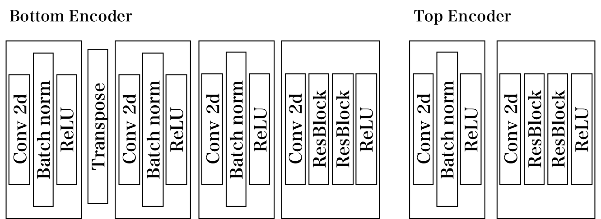
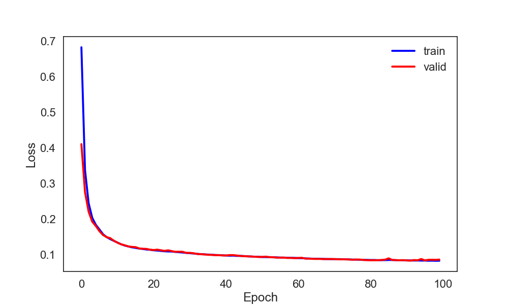
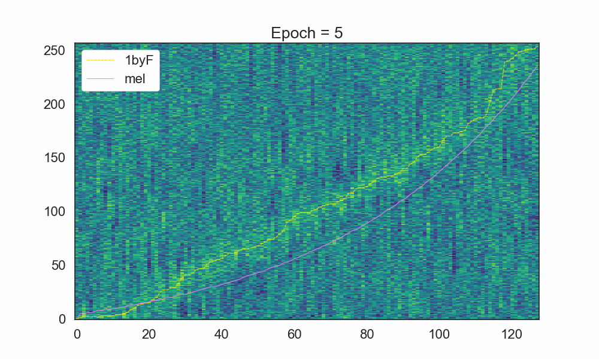
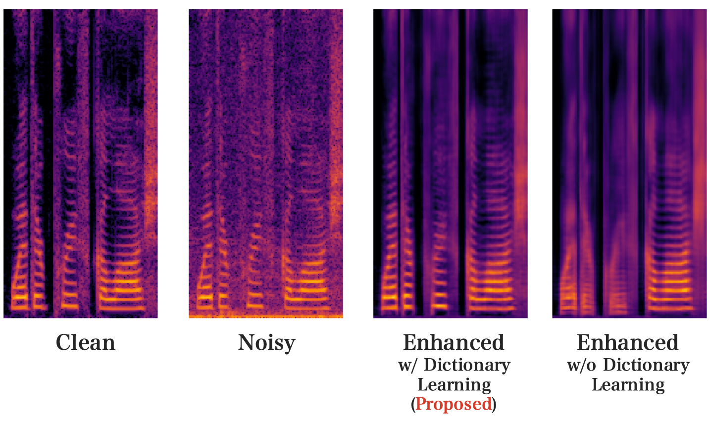
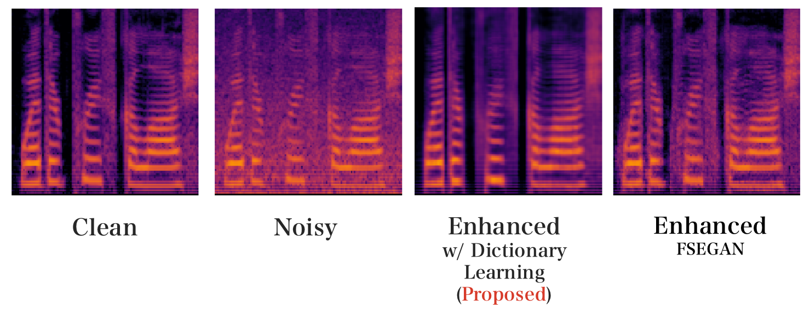
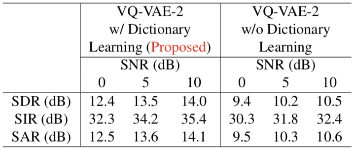

# Monaural Speech Enhancement using Modified VQ-VAE-2 based on Dictionary Learning
Model architecture is available in `model.py`.

<div align="center">

</div>

## Speech Enhancement model based on Dictionary Learning
#### Installation
```
pip install -r requirements.txt
```
Load TIMIT corpus and DEMAND dataset, preprocessing for training and validation:
```
bash dataset.sh
```
##### Pre-training
You can train the models as follows:
```
python run.py --pretrain
```
##### Main-training
```
python run.py --maintrain
```
If you want to change the training parameters, please refer to `run.py`.

##### Testing
```
bash checkpoint.sh [input_snr] [epoch]
```

#### Results

##### Loss (Pre-training of speech model)
<div align="center">

</div>

##### Modified 1-by-F filters (Pre-training of speech model)
<div align="center">

</div>

##### Loss (Main-training of enhancement model)
<div align="center">

</div>

##### Outputs qualitative comparison on the log/mel spectrograms of the test speaker
<div align="center">

</div>

<div align="center">

</div>

##### Quantitative comparison of the test speakers
<div align="center">

</div>

##### Sound samples
##### male speaker (SNR 5dB)
- [Clean](https://drive.google.com/file/d/15u8rbH9bX3wH1-lx_nEFMtgWXRSj5XfD/view?usp=sharing)
- [Nosiy](https://drive.google.com/file/d/1L4889XQtZGr9I2cJU22_SHhZ7vzObv4A/view?usp=sharing)
- [Enhanced (Proposed)](https://drive.google.com/file/d/1Sh8uFBfuRGEaREh-WVmew9DeTgHIny_j/view?usp=sharing)

##### male speaker (SNR 0dB)
- [Clean](https://drive.google.com/file/d/1h_tewUHlJBmC0xh5nlxSE5arghCMP2LA/view?usp=sharing)
- [Nosiy](https://drive.google.com/file/d/1cQ-a97b6rJ0nuaaF1T1LLqhrJVlTQrQ-/view?usp=sharing)
- [Enhanced (Proposed)](https://drive.google.com/file/d/1TgEEDVkYaGokG6ohEYIPWYhys-X5d8S3/view?usp=sharing)

##### female speaker (SNR 5dB)
- [Clean](https://drive.google.com/file/d/1kU0GP0SfZEdlEGQJFGSCHTsfVjD11Cec/view?usp=sharing)
- [Nosiy](https://drive.google.com/file/d/1J_ioJeN7Y5aQHyVl8TBRI11ZhWRItqEu/view?usp=sharing)
- [Enhanced (Proposed)](https://drive.google.com/file/d/10HwbGBvVVF2FPt52t3M6IWusH8VvMdCS/view?usp=sharing)

##### female speaker (SNR 0dB)
- [Clean](https://drive.google.com/file/d/1_6MyVj8OrGKaT2L8-LinkoIhXYw15wkV/view?usp=sharing)
- [Nosiy](https://drive.google.com/file/d/1VOxBrPYpxnwMlZ7IOb0772SB1RBHfxAB/view?usp=sharing)
- [Enhanced (Proposed)](https://drive.google.com/file/d/1NEupXMDvrgk0YoQ9FomryyxYUzawhz5w/view?usp=sharing)
