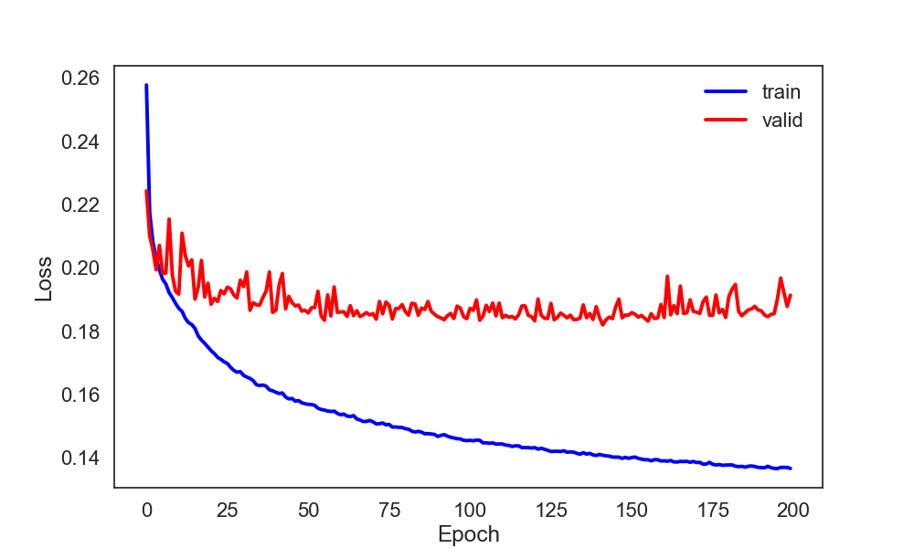
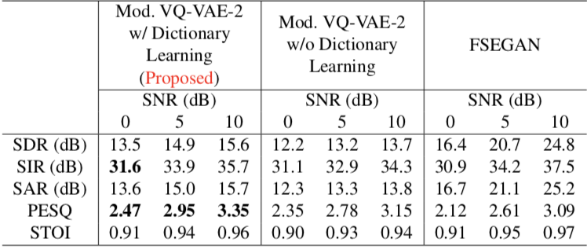

# Monaural Speech Enhancement using Modified VQ-VAE-2 based on Dictionary Learning
Model architecture is available in `model.py`.

<div align="center">

</div>

##### Encoder network architecture
<div align="center">

</div>

## Speech Enhancement model based on Dictionary Learning
#### Installation
```
pip install -r requirements.txt
```
Load TIMIT corpus and DEMAND dataset, preprocessing for training and validation:
```
bash dataset.sh
```
##### Pre-training
You can train the models as follows:
```
python run.py --pretrain
```
##### Main-training
```
python run.py --maintrain
```
If you want to change the training parameters, please refer to `run.py`.

##### Testing
```
bash checkpoint.sh [input_snr] [epoch]
```

#### Results

<!-- ##### Loss (Pre-training of speech model)
<div align="center">

</div> -->

##### Modified 1-by-F filters (Pre-training of speech model)
<div align="center">

</div>

<!-- ##### Loss (Main-training of enhancement model)
<div align="center">

</div> -->

##### Outputs qualitative comparison on the log spectrograms of the test speaker
<div align="center">

</div>

##### Quantitative comparison of the test speakers
<div align="center">

</div>

##### Sound samples
##### male speaker BPM0 (SNR 5dB)
- [Clean](https://drive.google.com/file/d/1WCiZfZ4UjAr2roRN9nNWbsKPaCRnKc4k/view?usp=sharing)
- [Noisy](https://drive.google.com/file/d/1S53SWKh1fp2TJKQfcHWssg_DE4JZgRHN/view?usp=sharing)
- [Enhanced (Proposed)](https://drive.google.com/file/d/1BF8KhdYd4OvtcPfpXU_9qqcU-D6Ez8D7/view?usp=sharing)
- [Enhanced (FSEGAN)](https://drive.google.com/file/d/1tSocrD39DDw7mjKSOjOpL69oeBNY4mHm/view?usp=sharing)

##### male speaker BPM0 (SNR 0dB)
- [Clean](https://drive.google.com/file/d/1WmttYJe0m7DEatUX7wB4B01vPqNhYCYc/view?usp=sharing)
- [Noisy](https://drive.google.com/file/d/1q6kQRXGYprJq7u29WqT00YZmveCNgYtS/view?usp=sharing)
- [Enhanced (Proposed)](https://drive.google.com/file/d/1kA9zfbhs35Mxae5PW-1dCWlpHEl_31PK/view?usp=sharing)
- [Enhanced (FSEGAN)](https://drive.google.com/file/d/1aczuXtguLOazv0JgyeE43vgojIg-V2-W/view?usp=sharing)

##### female speaker MLD0 (SNR 5dB)
- [Clean](https://drive.google.com/file/d/1euBp__8R7uydqaUwYmrKKHx2K_4ZZU1Z/view?usp=sharing)
- [Noisy](https://drive.google.com/file/d/1xIkpx2DLvqxQXS0Aup1-PMuZpaUzPEQJ/view?usp=sharing)
- [Enhanced (Proposed)](https://drive.google.com/file/d/1Bzfg1CBehvSceUb9M6YBG04OWwdvqFFP/view?usp=sharing)
- [Enhanced (FSEGAN)](https://drive.google.com/file/d/1o93E5SrCBj5VPckDqrZtSgm-RjCn939e/view?usp=sharing)

##### female speaker MLD0 (SNR 0dB)
- [Clean](https://drive.google.com/file/d/1fxwDn4I6jWCUZoISAWjrx6A_iCv1Lv8M/view?usp=sharing)
- [Noisy](https://drive.google.com/file/d/13jnh5tJxzWDsTMrMjf-7viwWFQuCs8ZR/view?usp=sharing)
- [Enhanced (Proposed)](https://drive.google.com/file/d/1SYdtgbTHYSOjK6Ae2Yz9xor_E837PJL-/view?usp=sharing)
- [Enhanced (FSEGAN)](https://drive.google.com/file/d/1qKMQOTtaiPSbtMvnzhgkSyknxWm9VQE1/view?usp=sharing)
